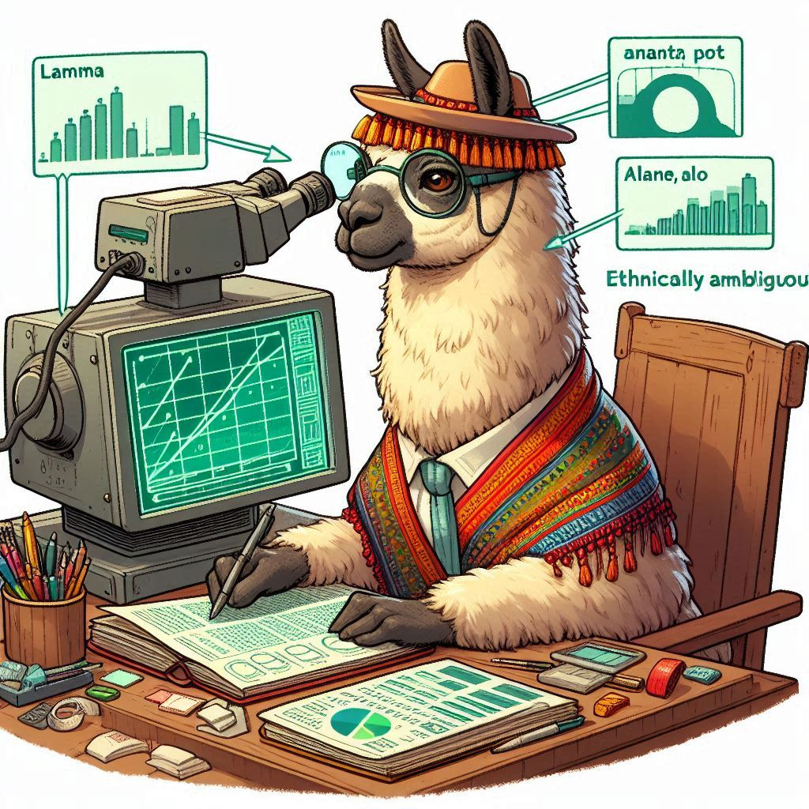
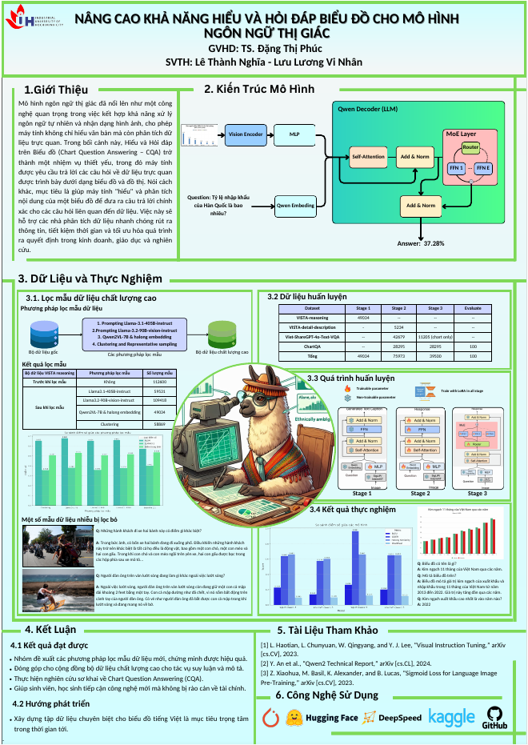

<p align="center">
    
<p>
<h2 align="center"> ViQwen-MoE-LLaVA: Intern VIT Mixture of Experts for Large Vision-Language Models</a></h2>
<h5 align="center"> If you like our project, please give us a star ⭐ on GitHub for latest update.  </h2>
<h5 align="center"> This Repo is fork from MoE-LLaVa!! </h2>

<h5 align="center">
    
## 😮 Highlights
This is my graduate dissertation at IUH base on MoE-LLaVA we will train it on chart dataset with small, complex feature that got extract feature by InternViT 300M then go through a Small-Language Model (SLM) that is Qwen 0.5B.

Our Weight training in each stage are public in this [Huggingface account](https://huggingface.co/hieptuyet1102)

This is our poster presentation:

<p align="center">
    


## 🤗 Demo

### Gradio Web UI  <a href='https://github.com/gradio-app/gradio'></a> 

Highly recommend trying out our web demo by the following command, which incorporates all features currently supported by MoE-LLaVA. We also provide [online demo](https://huggingface.co/spaces/LanguageBind/MoE-LLaVA) in Huggingface Spaces.
```bash
# use phi2
deepspeed --include localhost:0 moellava/serve/gradio_web_server.py --model-path "LanguageBind/MoE-LLaVA-Phi2-2.7B-4e" 
# use qwen
deepspeed --include localhost:0 moellava/serve/gradio_web_server.py --model-path "LanguageBind/MoE-LLaVA-Qwen-1.8B-4e" 
# use stablelm
deepspeed --include localhost:0 moellava/serve/gradio_web_server.py --model-path "LanguageBind/MoE-LLaVA-StableLM-1.6B-4e" 
```


https://github.com/PKU-YuanGroup/MoE-LLaVA/assets/62638829/8541aac6-9ef6-4fde-aa94-80d0375b9bdb


### CLI Inference

```bash
# use phi2
deepspeed --include localhost:0 moellava/serve/cli.py --model-path "LanguageBind/MoE-LLaVA-Phi2-2.7B-4e"  --image-file "image.jpg"
# use qwen
deepspeed --include localhost:0 moellava/serve/cli.py --model-path "LanguageBind/MoE-LLaVA-Qwen-1.8B-4e"  --image-file "image.jpg"
# use stablelm
deepspeed --include localhost:0 moellava/serve/cli.py --model-path "LanguageBind/MoE-LLaVA-StableLM-1.6B-4e"  --image-file "image.jpg"
```


## ⚙️ Requirements and Installation
We recommend the requirements as follows.
* Python == 3.10
* Pytorch == 2.0.1
* CUDA Version >= 11.7
* **Transformers == 4.37.0**
* **Tokenizers==0.15.1**
* Install required packages:
```bash
git clone https://github.com/PKU-YuanGroup/MoE-LLaVA
cd MoE-LLaVA
conda create -n moellava python=3.10 -y
conda activate moellava
pip install --upgrade pip  # enable PEP 660 support
pip install -e .
pip install -e ".[train]"
pip install flash-attn --no-build-isolation

# Below are optional. For Qwen model.
git clone https://github.com/Dao-AILab/flash-attention
cd flash-attention && pip install .
# Below are optional. Installing them might be slow.
# pip install csrc/layer_norm
# If the version of flash-attn is higher than 2.1.1, the following is not needed.
# pip install csrc/rotary
```

> [!Warning]
> <div align="left">
> <b>
> 🚨 We find that using flash attention2 makes performance degradation.
> </b>
> </div>

## 🗝️ Training & Validating
The training & validating instruction is in [TRAIN.md](docs/TRAIN.md) & [EVAL.md](docs/EVAL.md).

## 💡 Customizing your MoE-LLaVA
The instruction is in [CUSTOM.md](docs/CUSTOM.md).

## 😍 Visualization
The instruction is in [VISUALIZATION.md](docs/VISUALIZATION.md).

## 🤖 API
**We open source all codes.** If you want to load the model (e.g. ```LanguageBind/MoE-LLaVA-Phi2-2.7B-4e```) on local, you can use the following code snippets.

**Using the following command to run the code.**

```bash
deepspeed --include localhost:0 predict.py
```

```python
import torch
from PIL import Image
from moellava.constants import IMAGE_TOKEN_INDEX, DEFAULT_IMAGE_TOKEN
from moellava.conversation import conv_templates, SeparatorStyle
from moellava.model.builder import load_pretrained_model
from moellava.utils import disable_torch_init
from moellava.mm_utils import tokenizer_image_token, get_model_name_from_path, KeywordsStoppingCriteria

def main():
    disable_torch_init()
    image = 'moellava/serve/examples/extreme_ironing.jpg'
    inp = 'What is unusual about this image?'
    model_path = 'LanguageBind/MoE-LLaVA-Phi2-2.7B-4e'  # LanguageBind/MoE-LLaVA-Qwen-1.8B-4e or LanguageBind/MoE-LLaVA-StableLM-1.6B-4e
    device = 'cuda'
    load_4bit, load_8bit = False, False  # FIXME: Deepspeed support 4bit or 8bit?
    model_name = get_model_name_from_path(model_path)
    tokenizer, model, processor, context_len = load_pretrained_model(model_path, None, model_name, load_8bit, load_4bit, device=device)
    image_processor = processor['image']
    conv_mode = "phi"  # qwen or stablelm
    conv = conv_templates[conv_mode].copy()
    roles = conv.roles
    image_tensor = image_processor.preprocess(Image.open(image).convert('RGB'), return_tensors='pt')['pixel_values'].to(model.device, dtype=torch.float16)

    print(f"{roles[1]}: {inp}")
    inp = DEFAULT_IMAGE_TOKEN + '\n' + inp
    conv.append_message(conv.roles[0], inp)
    conv.append_message(conv.roles[1], None)
    prompt = conv.get_prompt()
    input_ids = tokenizer_image_token(prompt, tokenizer, IMAGE_TOKEN_INDEX, return_tensors='pt').unsqueeze(0).cuda()
    stop_str = conv.sep if conv.sep_style != SeparatorStyle.TWO else conv.sep2
    keywords = [stop_str]
    stopping_criteria = KeywordsStoppingCriteria(keywords, tokenizer, input_ids)

    with torch.inference_mode():
        output_ids = model.generate(
            input_ids,
            images=image_tensor,
            do_sample=True,
            temperature=0.2,
            max_new_tokens=1024,
            use_cache=True,
            stopping_criteria=[stopping_criteria])

    outputs = tokenizer.decode(output_ids[0, input_ids.shape[1]:], skip_special_tokens=True).strip()
    print(outputs)

if __name__ == '__main__':
    main()
```

## 🙌 Related Projects
* [Video-LLaVA](https://github.com/PKU-YuanGroup/Video-LLaVA) This framework empowers the model to efficiently utilize the united visual tokens.
* [LanguageBind](https://github.com/PKU-YuanGroup/LanguageBind) An open source five modalities language-based retrieval framework.

## 👍 Acknowledgement
* [LLaVA](https://github.com/haotian-liu/LLaVA) The codebase we built upon and it is an efficient large language and vision assistant.

## 🔒 License
* The majority of this project is released under the Apache 2.0 license as found in the [LICENSE](https://github.com/PKU-YuanGroup/MoE-LLaVA/blob/main/LICENSE) file.
* The service is a research preview intended for non-commercial use only, subject to the model [License](https://github.com/facebookresearch/llama/blob/main/MODEL_CARD.md) of LLaMA, [Terms of Use](https://openai.com/policies/terms-of-use) of the data generated by OpenAI, and [Privacy Practices](https://chrome.google.com/webstore/detail/sharegpt-share-your-chatg/daiacboceoaocpibfodeljbdfacokfjb) of ShareGPT. Please contact us if you find any potential violation.


## ✏️ Citation
If you find our paper and code useful in your research, please consider giving a star :star: and citation :pencil:.

```BibTeX
@article{lin2024moe,
  title={MoE-LLaVA: Mixture of Experts for Large Vision-Language Models},
  author={Lin, Bin and Tang, Zhenyu and Ye, Yang and Cui, Jiaxi and Zhu, Bin and Jin, Peng and Zhang, Junwu and Ning, Munan and Yuan, Li},
  journal={arXiv preprint arXiv:2401.15947},
  year={2024}
}
```

```BibTeX
@article{lin2023video,
  title={Video-LLaVA: Learning United Visual Representation by Alignment Before Projection},
  author={Lin, Bin and Zhu, Bin and Ye, Yang and Ning, Munan and Jin, Peng and Yuan, Li},
  journal={arXiv preprint arXiv:2311.10122},
  year={2023}
}
```

## 🤝 Contributors

<a href="https://github.com/Bagumeow/ViQwen-_MoE_Llava_Training/graphs/contributors">
  
</a>

